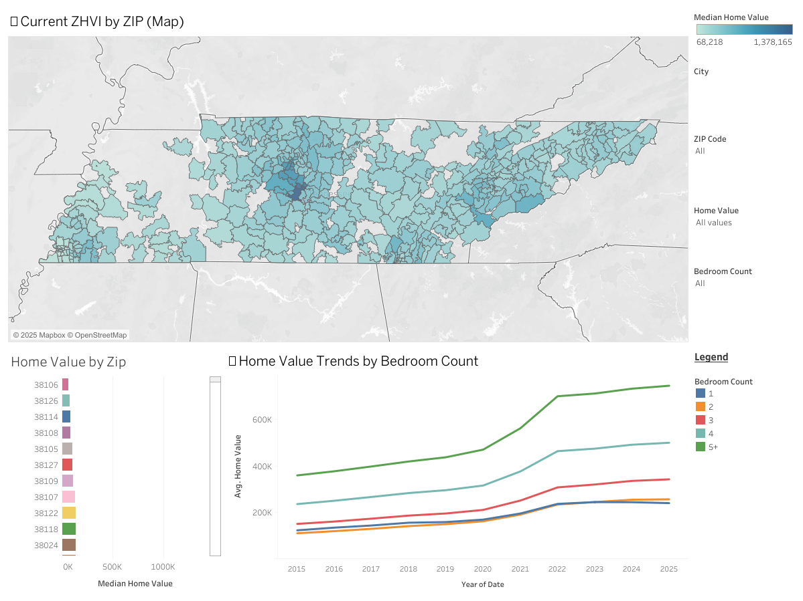

# zhvi-TN-housing-trends · v1.0.0


This project delivers a lightweight, SQLite-backed dataset of Tennessee housing trends, built from data sourced from Zillow. It features a reproducible Python pipeline that transforms raw ZHVI data into a structured, query-ready database—ideal for visualizations, dashboards, or deeper analysis.

---

### 👤 About the Author

Eric is a data-driven problem solver with a strong focus on reproducibility, precision, and thoughtful design. He combines technical expertise in Python, SQL, and ETL workflows with a meticulous approach to organization and documentation. This project reflects a commitment to building transparent, scalable tools for data exploration.

---

# 🏠 ZHVI Housing Trends Pipeline

This project analyzes Zillow Home Value Index (ZHVI) monthly data across U.S. by zip codes, dating back to year 2000 through May 2025. It automates the ingestion, transformation, and storage of large housing datasets into an SQLite database, enabling clean analysis and dashboard creation.

- Data Source: https://www.zillow.com/research/data/
    - Section: Home Values
    - Reports: ZHVI [1 - 5+] Bedroom Time Series ($)
    - Geography Used: Zip Code
    - Export Date: 6/19/2025


<pre><code>## 📁 Project Structure
zhvi-housing-trends/
├── data/
│   ├── zhvi_data.db             ← Final SQLite database
│   └── zhvi_tableau_ready.csv   ← Exported CSV for Tableau (generated by pipeline)
├── images/
│   └── tn_zhvi_explorer.png     ← Dashboard preview image
├── notebooks/
│   └── transform_load_db_pipeline.ipynb   ← Data pipeline (ETL)
├── zhvi_raw_files/
│   └── *.csv                    ← Raw Zillow CSV files (not tracked)
├── sql/
│   └── sample_queries.sql       ← Example SQL queries
├── .gitignore
└── README.md
</code></pre>


---

## 📊 Interactive Dashboard

Explore Tennessee housing trends with interactive filters by ZIP code, county, and bedroom count. View historical ZHVI data from 2000–2025 and compare regions using intuitive charts and a color-coded map.

[👉 View the dashboard on Tableau Public](https://public.tableau.com/views/Tennessee-ZillowHomeValueIndexExplorer/TennesseeZHVIExplorer)




🎯 **Key Features:**
- Filter by ZIP code, county, or bedroom count
- View monthly ZHVI trends from 2000–2025
- Identify affordable ZIP codes based on selected criteria


---

## ⚙️ How It Works

### 1. **Extract**
Raw `.csv` files representing home values by bedroom count are read from the `zhvi_raw_files/` folder.

### 2. **Transform**
- Filters for `RegionType = "zip"`
- Unpivots wide monthly columns into long format
- Extracts bedroom count from file names
- Cleans and converts data types for consistency

### 3. **Load**
The cleaned dataset is saved to `data/zhvi_data.db`, ready for fast SQL querying or dashboard consumption.


---

## 🔎 SQL Preview: Average ZHVI in Nashville (2020–present)

```
SELECT 
    strftime('%Y-%m', Date) AS Month,
    BedroomCount,
    RegionName AS "Zip Code",
    ROUND(AVG(HomeValue), 2) AS AvgHomeValue
FROM zhvi_data
WHERE State = 'TN' 
  AND City = 'Nashville' 
  AND strftime('%Y', Date) >= '2020'
GROUP BY Month, BedroomCount, RegionName
ORDER BY "Zip Code", BedroomCount, Month;
```

---

## 🚀 How to Run

```bash
git clone https://github.com/yourusername/zhvi-TN-housing-trends.git
cd zhvi-TN-housing-trends
pip install -r requirements.txt
python notebooks/transform_load_db_pipeline.py
```
> ⚠️ Note: Place all raw Zillow .csv files into the zhvi_raw_files/ folder before running the pipeline.


---

### 🔧 Building the Database Locally

#### 🛠 Tools Used

- Python (`pandas`, `sqlite3`)
- SQLite (via DB Browser or `pd.read_sql_query`)
- Jupyter & VS Code for development and testing

---

To build the `zhvi_data.db` file:

1. Clone this repository
2. Ensure the `zhvi_raw_files/` folders contain the provided `.csv` files
3. Run:  
   ```bash
   python notebooks/transform_load_db_pipeline.py

4. The database will be generated in `data/zhvi_data.db`


---


## 📄 License

MIT License. See `LICENSE.md` for details.
