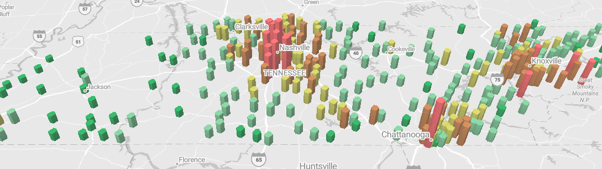
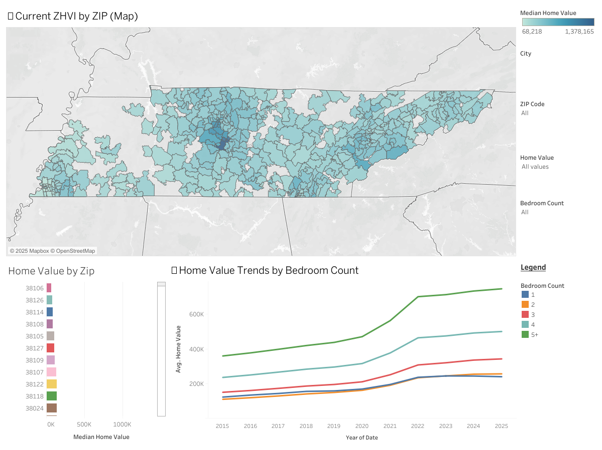

# zhvi-TN-housing-trends · v1.0.2


This project delivers a lightweight, SQLite-backed dataset of Tennessee housing trends, sourced from Zillow Home Value Index (ZHVI) data. It features a reproducible Python ETL pipeline that transforms raw ZHVI data into a structured, query-ready database, powering interactive visualizations in Power BI and Tableau. Explore advanced Power BI reports with DAX measures and a star schema, or dive into Tableau dashboards for regional trend analysis.

---

### 👤 About the Author

Eric is a data-driven problem solver with a strong focus on reproducibility, precision, and thoughtful design. He combines technical expertise in Python, SQL, Power Query, DAX, and ETL workflows with a meticulous approach to organization and documentation. This project reflects a commitment to building transparent, scalable tools for data exploration and visualization.

---

# 🏠 ZHVI Housing Trends Pipeline

This project analyzes Zillow Home Value Index (ZHVI) monthly data across U.S. by zip codes, dating back to year 2000 through May 2025. It automates the ingestion, transformation, and storage of large housing datasets into an SQLite database, enabling clean analysis and dashboard creation.

- **Data Source**: [Zillow Research Data](https://www.zillow.com/research/data/)
    - Section: Home Values
    - Reports: ZHVI [1 - 5+] Bedroom Time Series ($)
    - Geography Used: Zip Code
    - Export Date: 6/19/2025


<pre><code>## 📁 Project Structure
zhvi-housing-trends/
├── data/
│   ├── zhvi_data.db             ← Final SQLite database
│   └── zhvi_tableau_ready.csv   ← Exported CSV for Tableau (generated by pipeline)
├── images/
│   └── tn_zhvi_explorer.png     ← Tableau Dashboard preview image
│   └── zhvi_powerbi_screenshot.png    ← Power BI Report preview image
├── bi-visualization/
│   └── PowerBI_ZHVI_Trends_Tennessee_Home_Value_Insights.pdf     ← Power BI static report
├── notebooks/
│   └── transform_load_db_pipeline.ipynb   ← ETL pipeline notebook
├── zhvi_raw_files/
│   └── *.csv                    ← Raw Zillow CSV files (not tracked)
├── sql/
│   └── sample_queries.sql       ← Example SQL queries
├── .gitignore
└── README.md
</code></pre>


---

## 📈 Power BI Report: ZHVI Trends

Explore Tennessee housing trends through an interactive Power BI report built on a Python ETL pipeline and a star schema model. The 5-page report features advanced visuals, DAX-calculated measures, and Power Query transformations, with data enriched for null city values using [zip-codes.com](https://www.zip-codes.com/state/tn.asp). View the report on my [portfolio website](https://vanepoint.com) for a video demo and static PDF.

[👉 Watch the 2-minute demo video on YouTube](https://youtu.be/UYVYBIDZzG8)  
[📄 View the static PDF report](bi-visualization/PowerBI_ZHVI_Trends_Tennessee_Home_Value_Insights.pdf)



🎯 **Key Features:**
- **Data Model**: Star schema with FactHomeValue (Avg Home Value, YOY% measures), DateTable, DimCityMetro (City, County, ZIP), and DimRegion (distinct bedroom counts per region ID for filtering), built using Power Query with Region ID as the key.
- **Data Enrichment**: Filled null city values in DimCityMetro using an imported table from [zip-codes.com](https://www.zip-codes.com/state/tn.asp) via Power Query.
- **Interactive Slicers**: Filter by Bedroom Count (1–5+), County, City, and ZIP Code, applying across all pages.
- **Report Pages**:
  1. **Tennessee Avg Home Value by ZIP (May 2025)**: Azure Map using 3D column layer with color-coded categories (<$250k, $250k–<$350k, $350k–<$450k, $450k–<$650k, $650k+).
  2. **Avg Home Value by Year and Bedroom Count**: Line graph showing historical trends.
  3. **Home Value 5-Year Forecast (95% CI)**: Line chart with 10-year historical data and forecast, adjustable via slicers.
  4. **Residential Value Evolution by Bedroom Count (Animated)**: Scatter chart visualizing YOY% change vs. Avg Home Value.
  5. **YOY Price Change Rank by Bedroom Size**: Ribbon chart displaying a 20-year trend.
- **DAX Measures**: Calculated Avg Home Value and YOY% for dynamic analysis.
- **ETL Integration**: Uses the Python ETL pipeline to extract Zillow CSVs, transform into a star schema, and load into Power BI.

📢 **Note**: Contact me for a live demo to explore the report’s interactivity in Power BI.

---

## 📊 Tableau Dashboard: ZHVI Explorer

Explore Tennessee housing trends with interactive filters by ZIP code, county, and bedroom count. View historical ZHVI data from 2000–2025 and compare regions using intuitive charts and a heat map.

[👉 View the dashboard on Tableau Public](https://public.tableau.com/views/Tennessee-ZillowHomeValueIndexExplorer/TennesseeZHVIExplorer)




🎯 **Key Features:**
- Filter by ZIP code, city, or bedroom count
- View monthly ZHVI trends from 2000–2025
- Identify affordable ZIP codes based on selected criteria

---

## ⚙️ How It Works

### 1. **Extract**
Raw `.csv` files representing home values by bedroom count are read from the `zhvi_raw_files/` folder.

### 2. **Transform**
- Filters for `RegionType = "zip"`
- Unpivots wide monthly columns into long format
- Extracts bedroom count from file names
- Cleans and converts data types for consistency

### 3. **Load**
The cleaned dataset is saved to `data/zhvi_data.db`, ready for fast SQL querying or dashboard consumption.


---

## 🔎 SQL Preview: Average ZHVI in Nashville (2020–present)

```
SELECT 
    strftime('%Y-%m', Date) AS Month,
    BedroomCount,
    RegionName AS "Zip Code",
    ROUND(AVG(HomeValue), 2) AS AvgHomeValue
FROM zhvi_data
WHERE State = 'TN' 
  AND City = 'Nashville' 
  AND strftime('%Y', Date) >= '2020'
GROUP BY Month, BedroomCount, RegionName
ORDER BY "Zip Code", BedroomCount, Month;
```

---

## 🚀 How to Run

```bash
git clone https://github.com/yourusername/zhvi-TN-housing-trends.git
cd zhvi-TN-housing-trends
pip install -r requirements.txt
python notebooks/transform_load_db_pipeline.py
```
> ⚠️ Note: Place all raw Zillow .csv files into the zhvi_raw_files/ folder before running the pipeline.


---

### 🔧 Building the Database Locally

#### 🛠 Tools Used

- Python (`pandas`, `sqlite3`)
- SQLite (via DB Browser or `pd.read_sql_query`)
- Jupyter & VS Code for development and testing

---

To build the `zhvi_data.db` file:

1. Clone this repository
2. Ensure the `zhvi_raw_files/` folders contain the provided `.csv` files
3. Run:  
   ```bash
   python notebooks/transform_load_db_pipeline.py

4. The database will be generated in `data/zhvi_data.db`


---


## 📄 License

MIT License. See `LICENSE.md` for details.


